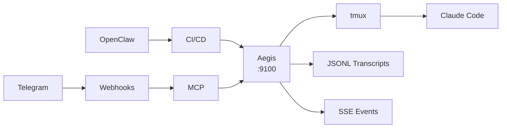
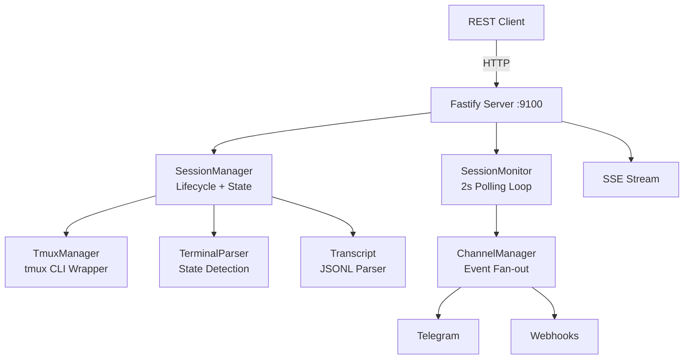

<p align="center">
  <picture>
    <source media="(prefers-color-scheme: dark)" srcset="docs/assets/aegis-logo-text-dark.svg">
    
  </picture>
</p>

<p align="center">
  
  
  
  
</p>

<p align="center">
  <strong>The bridge between your orchestrator and your coding agent.</strong>
</p>

<p align="center">
  Orchestrate Claude Code sessions via REST API, MCP, CLI, webhooks, or Telegram.
</p>

---

## The Aegis Ecosystem

Aegis sits at the center of your AI development workflow, connecting orchestrators, agents, and automation pipelines to Claude Code through a unified API layer.



Every integration talks to the same API. MCP lets AI agents self-orchestrate. Webhooks push events outward. Telegram brings it to your pocket.

---

## Quick Start

```bash
# 1. Install and start
npx aegis-bridge

# 2. Create a session
curl -X POST http://localhost:9100/v1/sessions \
  -H "Content-Type: application/json" \
  -d '{"name": "feature-auth", "workDir": "/home/user/my-project", "prompt": "Build a login page with email/password fields."}'

# 3. Monitor progress
curl http://localhost:9100/v1/sessions/abc123/read

# 4. Send a follow-up
curl -X POST http://localhost:9100/v1/sessions/abc123/send \
  -H "Content-Type: application/json" \
  -d '{"text": "Add form validation: email must contain @, password min 8 chars."}'
```

> **Prerequisites:** [tmux](https://github.com/tmux/tmux/wiki) and [Claude Code CLI](https://docs.anthropic.com/en/docs/claude-code).

---

## MCP Server

### Connect any AI agent to Claude Code

Aegis exposes its full API as an MCP (Model Context Protocol) server, letting any MCP-compatible agent discover and control Claude Code sessions natively. This is the fastest way to build multi-agent workflows -- one agent delegates work to another through a well-defined tool interface.

**Start the server:**

```bash
aegis-bridge mcp                    # connects to Aegis on port 9100
aegis-bridge mcp --port 3000        # custom port
```

**Add to Claude Code:**

```bash
claude mcp add --scope user aegis -- npx aegis-bridge mcp
```

Or add to `.mcp.json` in your project root:

```json
{
  "mcpServers": {
    "aegis": {
      "command": "npx",
      "args": ["aegis-bridge", "mcp"]
    }
  }
}
```

### Tools (21)

| Tool | Description |
|------|-------------|
| `list_sessions` | List sessions with optional status/workDir filters |
| `get_status` | Detailed status and health of a session |
| `get_transcript` | Read the conversation transcript |
| `send_message` | Send a message (with delivery verification) |
| `create_session` | Spawn a new Claude Code session |
| `kill_session` | Kill a session and clean up resources |
| `approve_permission` | Approve a pending permission prompt |
| `reject_permission` | Reject a pending permission prompt |
| `server_health` | Server health (version, uptime, session counts) |
| `escape_session` | Send Escape keypress to dismiss prompts |
| `interrupt_session` | Send Ctrl+C to interrupt current operation |
| `capture_pane` | Capture raw terminal pane content |
| `get_session_metrics` | Performance metrics (message counts, latency) |
| `get_session_summary` | Session summary (messages, duration, status) |
| `send_bash` | Execute a bash command in a session |
| `send_command` | Send a slash command to a session |
| `get_session_latency` | Latency metrics (avg, p99) |
| `batch_create_sessions` | Create multiple sessions in a single batch |
| `list_pipelines` | List all configured pipelines |
| `create_pipeline` | Create a multi-step pipeline |
| `get_swarm` | Snapshot of all Claude Code processes on the system |

### Resources (4)

| Resource | URI | Description |
|----------|-----|-------------|
| `sessions` | `aegis://sessions` | Active sessions (id, name, status, workDir) |
| `session-transcript` | `aegis://sessions/{id}/transcript` | Full JSONL transcript |
| `session-pane` | `aegis://sessions/{id}/pane` | Current terminal pane content |
| `health` | `aegis://health` | Server health (version, uptime, counts) |

### Prompts (3)

| Prompt | Description |
|--------|-------------|
| `implement_issue` | Generate a structured implementation prompt for a GitHub issue |
| `review_pr` | Generate a structured code review prompt for a PR |
| `debug_session` | Diagnostic summary for a stuck or misbehaving session |

---

## REST API

All endpoints prefixed with `/v1/`. Legacy `/` prefix also supported.

| Method | Endpoint | Description |
|--------|----------|-------------|
| `GET` | `/v1/health` | Server health, version, uptime |
| `POST` | `/v1/sessions` | Create a new session |
| `GET` | `/v1/sessions` | List all sessions |
| `GET` | `/v1/sessions/:id` | Session details (with `actionHints`) |
| `GET` | `/v1/sessions/:id/health` | Health check with actionable hints |
| `GET` | `/v1/sessions/:id/read` | Parsed transcript |
| `GET` | `/v1/sessions/:id/pane` | Raw terminal capture |
| `POST` | `/v1/sessions/:id/send` | Send a message |
| `POST` | `/v1/sessions/:id/approve` | Approve a permission prompt |
| `POST` | `/v1/sessions/:id/reject` | Reject a permission prompt |
| `POST` | `/v1/sessions/:id/interrupt` | Interrupt (Ctrl+C) |
| `POST` | `/v1/sessions/:id/escape` | Send Escape |
| `GET` | `/v1/sessions/:id/events` | SSE event stream |
| `GET` | `/v1/sessions/:id/summary` | Condensed transcript summary |
| `POST` | `/v1/sessions/:id/screenshot` | Screenshot a URL (requires Playwright) |
| `DELETE` | `/v1/sessions/:id` | Kill a session |
| `POST` | `/v1/sessions/batch` | Create sessions in parallel |
| `POST` | `/v1/pipelines` | Create a pipeline with stage dependencies |
| `GET` | `/v1/pipelines` | List all pipelines |
| `GET` | `/v1/pipelines/:id` | Get pipeline status |

### Session States

| State | Meaning | Action |
|-------|---------|--------|
| `working` | Actively generating | Wait or poll `/read` |
| `idle` | Waiting for input | Send via `/send` |
| `permission_prompt` | Awaiting approval | `/approve` or `/reject` |
| `bash_approval` | Shell command approval | `/approve` or `/reject` |
| `asking` | Claude Code asked a question | Read `/read`, respond `/send` |
| `stalled` | No output for >5 min | Nudge `/send` or kill `DELETE` |
| `unknown` | Just created | Poll `/health` |

---

## Integrations

### Telegram

Bidirectional chat interface with topic-per-session threading.

```bash
# Configure via environment
export AEGIS_TG_TOKEN="your-bot-token"
export AEGIS_TG_GROUP="-100xxxxxxxxx"

# Or in config
# ~/.aegis/config.json → { "tgBotToken": "...", "tgGroupId": "..." }
```

Each session gets its own Telegram topic. Messages flow both ways: send prompts from Telegram, get status updates and completion notices pushed to your phone.

### Webhooks

Push events to any endpoint with exponential backoff retry.

```bash
export AEGIS_WEBHOOKS="https://your-app.com/api/aegis-events,https://backup.example.com/hook"
```

Events include session creation, state changes, permission prompts, and completions. Retry with exponential backoff handles transient failures automatically.

### CI/CD Pipelines

Integrate Claude Code into your CI pipeline:

```bash
# Create a session from CI
curl -X POST http://aegis:9100/v1/sessions \
  -d '{"workDir": "/repo", "prompt": "Fix the failing test in test/auth.test.ts"}'

# Poll until complete
while [ "$(curl -s http://aegis:9100/v1/sessions/$ID/health | jq -r .status)" != "idle" ]; do
  sleep 10
done

# Read the result
curl -s http://aegis:9100/v1/sessions/$ID/read | jq '.messages[-1]'
```

### Batch Processing

Run multiple tasks in parallel:

```bash
for task in "add tests" "fix lint" "update deps"; do
  curl -X POST http://localhost:9100/v1/sessions \
    -d "{\"name\": \"$task\", \"workDir\": \"/repo\", \"prompt\": \"$task\"}" &
done
```

### Multi-Agent Orchestration

An AI orchestrator delegates coding tasks to Claude Code through Aegis:

```
Orchestrator → Aegis API → Claude Code → Code changes → PR
```

Works with [OpenClaw](https://openclaw.ai), custom orchestrators, or any agent that can make HTTP calls. The orchestrator monitors progress, sends refinements, and handles errors -- all without a human in the loop.

---

## Architecture



**How it works:**

1. Aegis creates a tmux window and launches Claude Code inside it
2. Messages are sent via `tmux send-keys` and verified via `capture-pane` (up to 3 retries)
3. Output is parsed from both `tmux capture-pane` and JSONL transcript files
4. Terminal state detection identifies: working, idle, permission prompts, errors, stalls
5. Events are fanned out to channels (Telegram, webhooks) and SSE streams
6. Background monitor detects stalls and extended inactivity with graduated thresholds

**Key properties:**
- No Claude SDK dependency -- pure tmux + JSONL
- No browser automation -- regex-based terminal parsing
- No database -- in-memory state + JSON file persistence
- Sessions are fully isolated in separate tmux windows

---

## Extending Aegis

### Channel System

Aegis uses a channel manager for event fan-out. Built-in channels:
- **TelegramChannel** -- Bidirectional, topic-per-session
- **WebhookChannel** -- Retry with exponential backoff

To add a new channel, implement the channel interface and register it with the ChannelManager. Channels receive typed events: session created, state changed, permission required, session completed.

### Hooks

Claude Code hooks (`src/hook.ts`) enable session ID discovery via `SessionStart` and `Stop` events. The hook writes to `~/.aegis/session_map.json`, which Aegis reads for dual ID discovery (hook-based + filesystem scanning).

### Contributing

1. Fork the repository
2. Create a feature branch: `git checkout -b feature/my-feature`
3. Write tests for your changes (tests go in `src/__tests__/`)
4. Ensure `npm test` passes
5. Open a Pull Request

```bash
# Development setup
git clone https://github.com/OneStepAt4time/aegis.git
cd aegis
npm install
npm run dev          # build + start server

# Run tests
npm test             # all tests
npx tsc --noEmit     # type-check only
```

### Project Structure

```
src/
├── cli.ts                # CLI entry point (npx aegis-bridge)
├── server.ts             # Fastify HTTP server + API routes
├── session.ts            # Session lifecycle management
├── tmux.ts               # tmux window/pane operations
├── monitor.ts            # Session state monitoring + events
├── terminal-parser.ts    # Terminal output state detection
├── transcript.ts         # JSONL transcript parsing
├── config.ts             # Configuration management
├── hook.ts               # CC hooks (session ID discovery)
├── hooks.ts              # Hook handler dispatch (SessionStart/Stop/StopFailure)
├── hook-settings.ts      # CC settings patch/restore for permission control
├── auth.ts               # Multi-key API auth + rate limiting
├── pipeline.ts           # Batch create + pipeline orchestration
├── mcp-server.ts         # MCP server mode (stdio transport)
├── events.ts             # SessionEventBus — SSE streaming per session
├── validation.ts         # Shared input validation utilities
├── screenshot.ts         # URL screenshot capture (Playwright)
├── ssrf.ts               # SSRF protection for outbound requests
├── metrics.ts            # Session metrics collection
├── permission-guard.ts   # Neutralizes project-level bypassPermissions
├── jsonl-watcher.ts      # Filesystem watcher for JSONL transcript files
├── sse-writer.ts         # SSE response writer helper
├── sse-limiter.ts        # SSE connection limiter per session
├── ws-terminal.ts        # WebSocket terminal streaming
├── swarm-monitor.ts      # System-wide CC process discovery
├── types.d.ts            # Shared type declarations
├── channels/
│   ├── index.ts          # Channel re-exports
│   ├── manager.ts        # ChannelManager — event fan-out
│   ├── telegram.ts       # TelegramChannel — bidirectional, topic-per-session
│   ├── telegram-style.ts # Telegram message formatting styles
│   ├── webhook.ts        # WebhookChannel — retry with exponential backoff
│   └── types.ts          # Channel type definitions
└── __tests__/            # Vitest test suite
```

---

## Configuration

**Config priority:** CLI `--config` > `./aegis.config.json` > `~/.aegis/config.json` > defaults

```json
// ~/.aegis/config.json
{
  "port": 9100,
  "tmuxSession": "aegis",
  "stallThresholdMs": 300000,
  "tgBotToken": "your-bot-token",
  "tgGroupId": "-100xxx"
}
```

**Environment variables:**

| Variable | Default | Description |
|----------|---------|-------------|
| `AEGIS_PORT` | 9100 | Server port |
| `AEGIS_HOST` | 127.0.0.1 | Server host |
| `AEGIS_AUTH_TOKEN` | -- | Bearer token for API auth |
| `AEGIS_TMUX_SESSION` | aegis | tmux session name |
| `AEGIS_STATE_DIR` | ~/.aegis | State directory |
| `AEGIS_TG_TOKEN` | -- | Telegram bot token |
| `AEGIS_TG_GROUP` | -- | Telegram group chat ID |
| `AEGIS_WEBHOOKS` | -- | Webhook URLs (comma-separated) |

---

## Support the Project

<p align="center">
  <a href="https://github.com/sponsors/OneStepAt4time">
    
  </a>
  <a href="https://ko-fi.com/onestepat4time">
    
  </a>
</p>

---

## License

MIT -- [Emanuele Santonastaso](https://github.com/OneStepAt4time)

<p align="center">
  Built by <a href="https://github.com/OneStepAt4time">OneStepAt4time</a>
</p>
