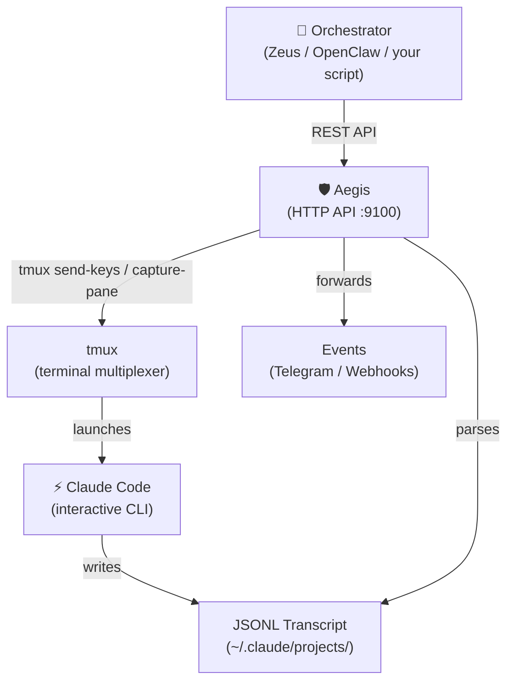

<p align="center">
  
  
  
  
</p>

<h1 align="center">🛡️ Aegis</h1>

<p align="center">
  <strong>Orchestrate Claude Code sessions via API.</strong>
</p>

<p align="center">
  Create, brief, monitor, refine, ship. The bridge between your orchestrator and your coding agent.
</p>

<p align="center">
  <code>npx aegis-bridge</code> → running in 30 seconds.
</p>

---

## Why Aegis?

Claude Code is the best AI coding agent. But it's interactive — it runs in a terminal, waits for prompts, asks permission, gets stuck. If you want to **automate** Claude Code — run it from a script, an orchestrator, a CI pipeline, or a multi-agent system — you need a bridge.

**Aegis is that bridge.**

It wraps Claude Code in tmux, exposes an HTTP API, and gives you programmatic control over the full session lifecycle:

| What | How |
|------|-----|
| **Create** a coding session | `POST /v1/sessions` with a project brief |
| **Monitor** real-time progress | `GET /v1/sessions/:id/read` — parsed transcript |
| **Send** follow-up messages | `POST /v1/sessions/:id/send` — refine, nudge, unblock |
| **Approve** permission prompts | `POST /v1/sessions/:id/approve` |
| **Detect** session state | `GET /v1/sessions/:id/health` — working/idle/stalled/permission_prompt |
| **Control** the session | Interrupt, reject, escape, kill |

No Claude SDK. No browser automation. No fragile screen scraping. Just tmux + JSONL transcript parsing + a clean REST API.

---

## Quick Start

### 1. Install

```bash
npx aegis-bridge
```

That's it. Aegis auto-detects tmux and Claude Code, prints a startup banner, and starts listening.

> **Prerequisites:** [tmux](https://github.com/tmux/tmux/wiki) and [Claude Code CLI](https://docs.anthropic.com/en/docs/claude-code) must be installed.

### 2. Create a session

```bash
curl -X POST http://localhost:9100/v1/sessions \
  -H "Content-Type: application/json" \
  -d '{
    "name": "feature-auth",
    "workDir": "/home/user/my-project",
    "brief": "Build a login page with email/password fields. Use the existing Button component from src/components/ui/Button.tsx."
  }'
```

Response:
```json
{
  "id": "abc123",
  "windowName": "feature-auth",
  "workDir": "/home/user/my-project",
  "status": "unknown"
}
```

### 3. Monitor progress

```bash
curl http://localhost:9100/v1/sessions/abc123/read
```

### 4. Refine

```bash
curl -X POST http://localhost:9100/v1/sessions/abc123/send \
  -H "Content-Type: application/json" \
  -d '{"text": "Add validation: email must contain @, password min 8 chars."}'
```

---

## Architecture



**How it works:**

1. Aegis creates a tmux window and launches Claude Code inside it
2. Briefs and messages are sent via `tmux send-keys`
3. Claude Code's output is captured via `tmux capture-pane` and JSONL transcript files
4. Terminal state detection identifies: working, idle, permission prompts, errors
5. Events (status changes, completions) are forwarded to Telegram or webhooks

---

## API Reference

All endpoints are prefixed with `/v1/` (legacy `/` prefix also supported).

### Server

| Method | Endpoint | Description |
|--------|----------|-------------|
| GET | `/v1/health` | Server health, version, uptime, session count |

### Sessions

| Method | Endpoint | Description |
|--------|----------|-------------|
| POST | `/v1/sessions` | Create a new Claude Code session |
| GET | `/v1/sessions` | List all sessions |
| GET | `/v1/sessions/:id` | Get session details (includes `actionHints` for permission prompts) |
| GET | `/v1/sessions/:id/health` | Health check with actionable hints |
| GET | `/v1/sessions/:id/read` | Read parsed transcript |
| GET | `/v1/sessions/:id/pane` | Raw terminal capture |
| POST | `/v1/sessions/:id/send` | Send a message to Claude Code |
| POST | `/v1/sessions/:id/command` | Run a raw tmux command |
| POST | `/v1/sessions/:id/approve` | Approve a permission prompt (sends `y`) |
| POST | `/v1/sessions/:id/reject` | Reject a permission prompt (sends `n`) |
| POST | `/v1/sessions/:id/escape` | Send Escape to cancel current input |
| POST | `/v1/sessions/:id/interrupt` | Interrupt Claude Code (Ctrl+C) |
| GET | `/v1/sessions/:id/events` | SSE event stream (real-time status, messages, approvals) |
| POST | `/v1/sessions/:id/screenshot` | Capture a screenshot of a URL (requires Playwright) |
| DELETE | `/v1/sessions/:id` | Kill the session |
| POST | `/v1/sessions/batch` | Create multiple sessions in parallel |
| POST | `/v1/pipelines` | Create a pipeline with stage dependencies |
| GET | `/v1/pipelines/:id` | Get pipeline status |
| GET | `/v1/pipelines` | List all pipelines |

### Create Session

```bash
curl -X POST http://localhost:9100/v1/sessions \
  -H "Content-Type: application/json" \
  -d '{
    "name": "my-task",
    "workDir": "/path/to/project",
    "brief": "Build a feature...",
    "stallThresholdMs": 300000,
    "claudeCommand": "claude",
    "env": { "NODE_ENV": "development" }
  }'
```

| Field | Type | Default | Description |
|-------|------|---------|-------------|
| `name` | string | `cc-<random>` | tmux window name |
| `workDir` | string | **required** | Working directory for Claude Code |
| `brief` | string | — | Initial task description (sent after CC starts) |
| `stallThresholdMs` | number | 300000 (5 min) | No-output timeout before `stalled` status |
| `claudeCommand` | string | `claude` | Command to launch Claude Code |
| `env` | object | — | Environment variables set in the tmux pane |
| `resumeSessionId` | string | — | Resume a specific Claude Code session |

### Send Message

```bash
curl -X POST http://localhost:9100/v1/sessions/:id/send \
  -H "Content-Type: application/json" \
  -d '{"text": "Fix the import errors in Header.tsx"}'
```

Delivery is verified via `capture-pane` — if the text doesn't appear, Aegis retries up to 3 times.

### Session States

| State | Meaning | What to do |
|-------|---------|------------|
| `working` | Claude Code is actively generating | Wait, or poll `/read` |
| `idle` | Waiting for input (task done or paused) | Send a new message via `/send` |
| `permission_prompt` | Waiting for file/command approval | `/approve` or `/reject` |
| `bash_approval` | Waiting for shell command approval | `/approve` or `/reject` |
| `asking` | Claude Code asked a question | Read via `/read`, respond via `/send` |
| `stalled` | No output for >5 minutes | Nudge via `/send` or kill via `DELETE` |
| `unknown` | Session just created, not yet detected | Wait a few seconds, poll `/health` |

### Health Check (with action hints)

```bash
curl http://localhost:9100/v1/sessions/:id/health
```

```json
{
  "alive": true,
  "status": "permission_prompt",
  "details": "Claude is waiting for permission approval. POST /v1/sessions/abc123/approve to approve, or /v1/sessions/abc123/reject to reject.",
  "actionHints": {
    "approve": { "method": "POST", "url": "/v1/sessions/abc123/approve", "description": "Approve the pending permission" },
    "reject": { "method": "POST", "url": "/v1/sessions/abc123/reject", "description": "Reject the pending permission" }
  }
}
```

### Screenshot (Issue #22)

Capture a screenshot of any URL — useful for visual verification of CC's output.

```bash
curl -X POST http://localhost:9100/v1/sessions/:id/screenshot \
  -H "Content-Type: application/json" \
  -d '{"url": "https://example.com", "fullPage": true, "width": 1920, "height": 1080}'
```

```json
{
  "screenshot": "iVBORw0KGgoAAAANSUhEUg...",
  "timestamp": "2026-03-22T14:00:00.000Z",
  "url": "https://example.com",
  "width": 1920,
  "height": 1080
}
```

> **Note:** Requires Playwright. Returns `501 Not Implemented` if not installed.
> Install with: `npx playwright install chromium && npm install -D playwright`

---

## CLI

```bash
# Start the server
aegis-bridge
aegis-bridge --port 3000

# Create a session from the command line
aegis-bridge create "Build a login page" --cwd /path/to/project

# Help
aegis-bridge --help
aegis-bridge --version
```

### Environment Variables

| Variable | Default | Description |
|----------|---------|-------------|
| `AEGIS_PORT` | 9100 | Server port |
| `AEGIS_HOST` | 127.0.0.1 | Server host |
| `AEGIS_AUTH_TOKEN` | — | Bearer token for API auth |
| `AEGIS_TMUX_SESSION` | aegis | tmux session name |
| `AEGIS_STATE_DIR` | ~/.aegis | State directory |
| `AEGIS_TG_TOKEN` | — | Telegram bot token |
| `AEGIS_TG_GROUP` | — | Telegram group chat ID |
| `AEGIS_WEBHOOKS` | — | Webhook URLs (comma-separated) |

---

## Configuration

Create `~/.aegis/config.json`:

```json
{
  "port": 9100,
  "tmuxSession": "aegis",
  "claudePath": "claude",
  "stallThresholdMs": 300000,
  "channels": {
    "telegram": {
      "enabled": true,
      "botToken": "your-bot-token",
      "chatId": "-100xxx"
    }
  }
}
```

---

## Use Cases

### 🤖 Multi-Agent Orchestration

An AI orchestrator (like [OpenClaw](https://openclaw.ai)) delegates coding tasks to Claude Code:

```
Orchestrator → Aegis API → Claude Code → Code changes → PR
```

The orchestrator monitors progress, sends refinements, and handles errors — all without a human in the loop.

### 🔄 CI/CD Pipeline

Integrate Claude Code into your CI:

```bash
# Create session with a fix brief
curl -X POST http://aegis:9100/v1/sessions \
  -d '{"workDir": "/repo", "brief": "Fix the failing test in test/auth.test.ts"}'

# Poll until idle
while [ "$(curl -s http://aegis:9100/v1/sessions/$ID/health | jq -r .status)" != "idle" ]; do sleep 10; done

# Read the result
curl -s http://aegis:9100/v1/sessions/$ID/read | jq '.messages[-1]'
```

### 📡 Webhook Automation

Trigger Claude Code from any event:

```bash
# n8n workflow, GitHub Actions, Slack bot, etc.
curl -X POST http://aegis:9100/v1/sessions \
  -d '{"name": "issue-42", "workDir": "/repo", "brief": "Fix issue #42: users cannot reset password"}'
```

### 🧪 Batch Processing

Run multiple tasks in parallel:

```bash
for task in "add tests" "fix lint" "update deps"; do
  curl -X POST http://localhost:9100/v1/sessions \
    -d "{\"name\": \"$task\", \"workDir\": \"/repo\", \"brief\": \"$task\"}" &
done
```

---

## Aegis vs Alternatives

| Feature | Aegis | Claude Code SDK | Direct CC |
|---------|-------|-----------------|-----------|
| **Session management** | ✅ Multi-session, lifecycle API | ❌ Single session | ❌ Manual |
| **Real-time monitoring** | ✅ JSONL transcript parsing | ⚠️ Event stream | ❌ Terminal only |
| **Permission handling** | ✅ API approve/reject | ⚠️ SDK callbacks | ✅ Interactive |
| **Terminal state detection** | ✅ working/idle/stalled | ❌ | ❌ |
| **Notifications** | ✅ Telegram, webhooks | ❌ | ❌ |
| **No Claude SDK dependency** | ✅ tmux only | ❌ Requires SDK | ✅ |
| **Multi-agent orchestration** | ✅ Built for it | ⚠️ Possible | ❌ |
| **Setup complexity** | `npx aegis-bridge` | npm package | CLI install |

---

## Development

```bash
git clone https://github.com/OneStepAt4time/aegis.git
cd aegis
npm install
npm run build

# Run tests
npm test

# Development mode (build + start)
npm run dev
```

### Project Structure

```
src/
├── cli.ts              # CLI entry point (npx aegis-bridge)
├── server.ts           # Fastify HTTP server + API routes
├── session.ts          # Session lifecycle management
├── tmux.ts             # tmux window/pane operations
├── monitor.ts          # Session state monitoring + events
├── terminal-parser.ts  # Terminal output state detection
├── transcript.ts       # JSONL transcript parsing
├── config.ts           # Configuration management
├── hook.ts             # CC hooks (session ID discovery)
└── __tests__/          # 342 tests
```

---

## Contributing

1. Fork the repository
2. Create a feature branch: `git checkout -b feat/my-feature`
3. Write tests for your changes
4. Ensure `npm test` passes (all 342 tests)
5. Open a Pull Request

---

## License

MIT — [Emanuele Santonastaso](https://github.com/OneStepAt4time)

---

<p align="center">
  Built with ⚡ by <a href="https://github.com/OneStepAt4time">OneStepAt4time</a>
</p>
