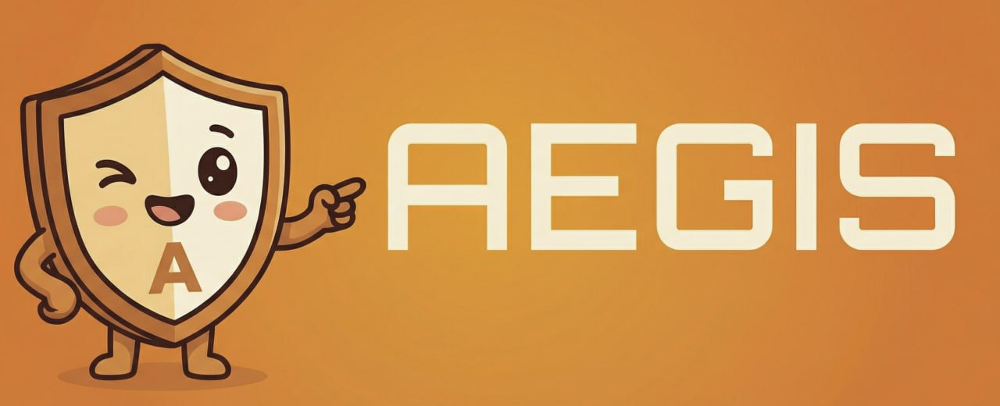
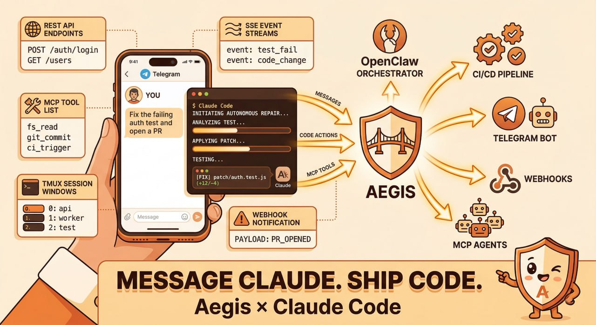
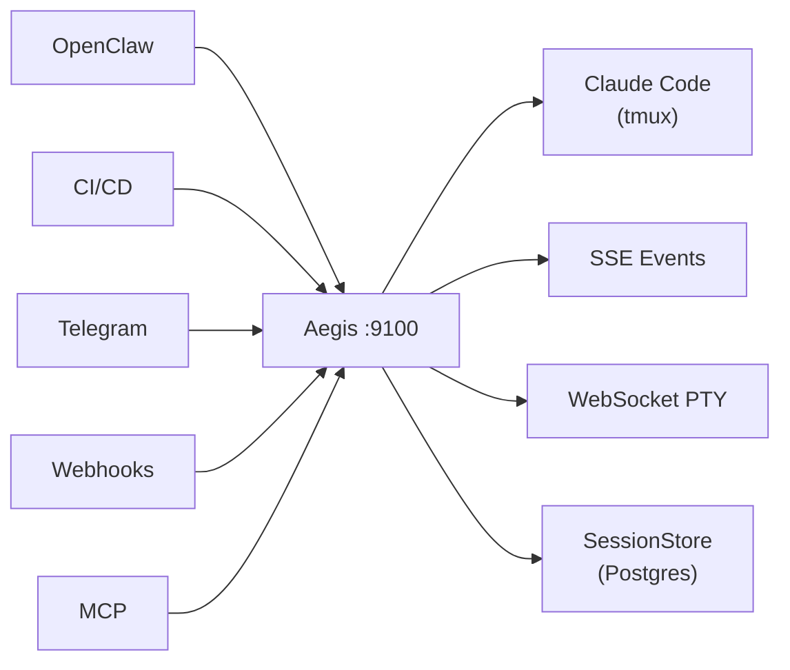

<p align="center">
  
</p>

<p align="center">
  
  
  
  
  
  <a href="https://github.com/OneStepAt4time/aegis/blob/main/ROADMAP.md"></a>
</p>

> ⚠️ **Aegis is in Preview.** APIs may change. See [ROADMAP.md](./ROADMAP.md) for the path to stable.
> Current release channel is `preview`.
>
> **Phase 3 (Team & Early-Enterprise) is now active.** Phase 2 is complete. See the [roadmap](./ROADMAP.md) for what's next.
>
> 📦 **Package renamed:** `aegis-bridge` → [`@onestepat4time/aegis`](https://www.npmjs.com/package/@onestepat4time/aegis). See [Migration Guide](docs/migration-guide.md) if you're upgrading.

<p align="center">
  <strong>Orchestrate Claude Code sessions via REST API, MCP, CLI, webhooks, or Telegram.</strong>
</p>

<p align="center">
  
</p>

---

## Quick Start

```bash
# Install, bootstrap, and start
npm install -g @onestepat4time/aegis
ag init
ag

# Scaffold a repo-local starter
ag init --list-templates
ag init --from-template code-reviewer
ag doctor

# Create a session
ag create "Build a login page with email/password fields." --cwd /path/to/project
```

> **CLI naming:** the primary command is `ag` (e.g. `ag`, `ag mcp`, `ag create "brief"`). The legacy name `aegis` is preserved as an alias, so any existing scripts using `aegis` keep working.

Built-in starter templates include `code-reviewer`, `ci-runner`, `pr-reviewer`, and `docs-writer`.

> **Prerequisites:** [tmux](https://github.com/tmux/tmux) and [Claude Code CLI](https://docs.anthropic.com/en/docs/claude-code).

### Windows Setup

On Windows, use psmux as the tmux-compatible backend before starting Aegis.

```powershell
choco install psmux -y
npm install -g @onestepat4time/aegis
ag
```

For full setup, verification, and troubleshooting, see [Windows Setup](docs/windows-setup.md).

For a full walkthrough from install to first session, see [Getting Started](docs/getting-started.md). For advanced features (pipelines, Memory Bridge, templates), see [Advanced Features](docs/advanced.md). For OpenAI-compatible provider setup (GLM, OpenRouter, LM Studio, Ollama, Azure OpenAI), see [BYO LLM](docs/byo-llm.md). For deployment and secure access away from localhost, see [Deployment Guide](docs/deployment.md) and [Remote Access](docs/remote-access.md). For the full MCP tools reference, see [MCP Tools](docs/mcp-tools.md).

---

## How It Works

Aegis wraps Claude Code in tmux sessions and exposes everything through a unified API. No SDK dependency, no browser automation — just tmux + JSONL transcript parsing.

1. Creates a tmux window → launches Claude Code inside it
2. Sends messages via `tmux send-keys` with delivery verification (up to 3 retries)
3. Parses output from both terminal capture and JSONL transcripts
4. Detects state changes via **VT100 screen buffer analysis** — clean, reliable idle detection
5. Streams terminal output in real-time via **WebSocket PTY streaming** (`tmux pipe-pane`)
6. Fans out events to Telegram, Slack, Email, webhooks, and SSE streams
7. Stores session state in a pluggable **SessionStore** (in-memory default, PostgreSQL available)



---

## MCP Server

Connect any MCP-compatible agent to Claude Code — the fastest way to build multi-agent workflows.

```bash
# Start standalone
ag mcp

# Add to Claude Code
claude mcp add --scope user aegis -- ag mcp
```

Or via `.mcp.json`:

```json
{
  "mcpServers": {
    "aegis": {
      "command": "ag",
      "args": ["mcp"]
    }
  }
}
```

Without a global install, use `"command": "npx"` with `["--package=@onestepat4time/aegis", "ag", "mcp"]` instead.

**24 tools** — `create_session`, `send_message`, `get_transcript`, `approve_permission`, `batch_create_sessions`, `create_pipeline`, `state_set`, and more.

**4 resources** — `aegis://sessions`, `aegis://sessions/{id}/transcript`, `aegis://sessions/{id}/pane`, `aegis://health`

**3 prompts** — `implement_issue`, `review_pr`, `debug_session`

## Ecosystem Integrations

Aegis works beyond Claude Code anywhere an MCP host can launch a local stdio server.

- [CLI Reference](docs/integrations/cli.md) — `ag` command-line tool (alias: `aegis`)
- [Notification Channels](docs/integrations/notifications.md) — Telegram, Slack, Email, Webhooks
- [Cursor integration](docs/integrations/cursor.md)
- [Windsurf integration](docs/integrations/windsurf.md)
- [MCP Registry preparation](docs/integrations/mcp-registry.md)

---

## REST API

All endpoints under `/v1/`.

| Method | Endpoint | Description |
|--------|----------|-------------|
| `GET` | `/v1/health` | Server health & uptime |
| `POST` | `/v1/sessions` | Create (or reuse) a session |
| `GET` | `/v1/sessions` | List sessions |
| `GET` | `/v1/sessions/:id` | Session details |
| `GET` | `/v1/sessions/:id/read` | Parsed transcript |
| `GET` | `/v1/sessions/:id/events` | SSE event stream |
| `POST` | `/v1/sessions/:id/send` | Send a message |
| `POST` | `/v1/sessions/:id/approve` | Approve permission |
| `POST` | `/v1/sessions/:id/reject` | Reject permission |
| `POST` | `/v1/sessions/:id/interrupt` | Ctrl+C |
| `POST` | `/v1/sessions/:id/discover-commands` | Discover available slash commands |
| `DELETE` | `/v1/sessions/:id` | Kill session |
| `POST` | `/v1/sessions/batch` | Batch create |
| `POST` | `/v1/handshake` | Capability negotiation |
| `POST` | `/v1/pipelines` | Create pipeline |
| `POST` | `/v1/memory` | Set memory entry |
| `GET` | `/v1/memory` | List memory entries |
| `GET` | `/v1/memory/:key` | Get memory entry |
| `DELETE` | `/v1/memory/:key` | Delete memory entry |
| `POST` | `/v1/templates` | Create session template |
| `GET` | `/v1/templates` | List templates |
| `GET` | `/v1/templates/:id` | Get template |
| `PUT` | `/v1/templates/:id` | Update template |
| `DELETE` | `/v1/templates/:id` | Delete template |
| `POST` | `/v1/dev/route-task` | Route task to model tier |
| `GET` | `/v1/dev/model-tiers` | List model tiers |
| `GET` | `/v1/diagnostics` | Server diagnostics |

<details>
<summary>Full API Reference</summary>

| Method | Endpoint | Description |
|--------|----------|-------------|
| `GET` | `/v1/sessions/:id/pane` | Raw terminal capture |
| `GET` | `/v1/sessions/:id/health` | Health check with actionable hints |
| `GET` | `/v1/sessions/:id/summary` | Condensed transcript summary |
| `GET` | `/v1/sessions/:id/transcript/cursor` | Cursor-based transcript replay |
| `POST` | `/v1/sessions/:id/screenshot` | Screenshot a URL (Playwright) |
| `POST` | `/v1/sessions/:id/escape` | Send Escape |
| `GET` | `/v1/pipelines` | List all pipelines |
| `GET` | `/v1/pipelines/:id` | Get pipeline status |

</details>

<details>
<summary>Session States</summary>

| State | Meaning | Action |
|-------|---------|--------|
| `working` | Actively generating | Wait or poll `/read` |
| `idle` | Waiting for input | Send via `/send` |
| `permission_prompt` | Awaiting approval | `/approve` or `/reject` |
| `asking` | Claude asked a question | Read `/read`, respond `/send` |
| `stalled` | No output for >5 min | Nudge `/send` or `DELETE` |

</details>

<details>
<summary>Session Reuse</summary>

When you `POST /v1/sessions` (or `POST /sessions`) with a `workDir` that already has an **idle** session, Aegis reuses that session instead of creating a duplicate. The existing session's prompt is delivered and you get the same session object back.

**Response differences:**

| | New Session | Reused Session |
|---|---|---|
| Status | `201 Created` | `200 OK` |
| `reused` | `false` | `true` |
| `promptDelivery` | `{ delivered, attempts }` | `{ delivered, attempts }` |

```bash
# First call → creates session (201)
curl -s -o /dev/null -w "%{http_code}" -X POST http://localhost:9100/v1/sessions \
  -H "Content-Type: application/json" \
  -d '{"workDir": "/home/user/project", "prompt": "Fix the tests"}'
# → 201

# Same workDir while idle → reuses session (200)
curl -s -o /dev/null -w "%{http_code}" -X POST http://localhost:9100/v1/sessions \
  -H "Content-Type: application/json" \
  -d '{"workDir": "/home/user/project", "prompt": "Now add error handling"}'
# → 200, body includes "reused": true
```

Only **idle** sessions are reused. Working, stalled, or permission-prompt sessions are ignored — a new one is created.

</details>

<details>
<summary>Capability Handshake</summary>

Before using advanced integration paths, clients can negotiate capabilities with Aegis via `POST /v1/handshake`. This prevents version-drift breakage.

```bash
curl -X POST http://localhost:9100/v1/handshake \
  -H "Content-Type: application/json" \
  -d '{"protocolVersion": "1", "clientCapabilities": ["session.create", "session.transcript.cursor"]}'
```

**Response** (200 OK when compatible):

```json
{
  "protocolVersion": "1",
  "serverCapabilities": ["session.create", "session.resume", "session.approve", "session.transcript", "session.transcript.cursor", "session.events.sse", "session.screenshot", "hooks.pre_tool_use", "hooks.post_tool_use", "hooks.notification", "hooks.stop", "swarm", "metrics"],
  "negotiatedCapabilities": ["session.create", "session.transcript.cursor"],
  "warnings": [],
  "compatible": true
}
```

| Field | Description |
|-------|-------------|
| `protocolVersion` | Server's protocol version (`"1"` currently) |
| `serverCapabilities` | Full list of server-supported capabilities |
| `negotiatedCapabilities` | Intersection of client + server capabilities |
| `warnings` | Non-fatal issues (unknown caps, version skew) |
| `compatible` | `true` (200) or `false` (409 Conflict) |

Returns **409** if the client's `protocolVersion` is below the server minimum.

</details>

<details>
<summary>Cursor-Based Transcript Replay</summary>

Stable pagination for long transcripts that doesn't skip or duplicate messages under concurrent appends. Use instead of offset-based `/read` when you need reliable back-paging.

```bash
# Get the newest 50 messages
curl http://localhost:9100/v1/sessions/abc123/transcript/cursor

# Get the next page (pass oldest_id from previous response)
curl "http://localhost:9100/v1/sessions/abc123/transcript/cursor?before_id=16&limit=50"

# Filter by role
curl "http://localhost:9100/v1/sessions/abc123/transcript/cursor?role=user"
```

**Query params:**

| Param | Default | Description |
|-------|---------|-------------|
| `before_id` | (none) | Cursor ID to page before. Omit for newest entries. |
| `limit` | `50` | Entries per page (1–200). |
| `role` | (none) | Filter: `user`, `assistant`, or `system`. |

**Response:**

```json
{
  "messages": [...],
  "has_more": true,
  "oldest_id": 16,
  "newest_id": 25
}
```

Cursor IDs are stable — they won't shift when new messages are appended. Use `oldest_id` from one response as `before_id` in the next to page backwards without gaps or overlaps.

</details>

---

### Telegram

Bidirectional chat with topic-per-session threading. Send prompts from your phone, get completions pushed back.

```bash
export AEGIS_TG_TOKEN="your-bot-token"
export AEGIS_TG_GROUP="-100xxxxxxxxx"
```

### Webhooks

Push events to any endpoint with exponential backoff retry.

```bash
export AEGIS_WEBHOOKS="https://your-app.com/api/aegis-events"
```

### Multi-Agent Orchestration

AI orchestrators delegate coding tasks through Aegis — monitor progress, send refinements, handle errors, all without a human in the loop.

Works with [OpenClaw](https://openclaw.ai), custom orchestrators, or any agent that can make HTTP calls.

### Web Dashboard

Aegis ships with a built-in dashboard at `http://localhost:9100/dashboard/` — real-time session monitoring, activity streams, and health overview.

**Dashboard features:**
- Dark/light theme with system preference detection
- Full accessibility pass — ARIA landmarks, labels, skip-to-content, 24 a11y tests
- Internationalization scaffolding with language switcher (Italian catalog shipped)
- Keyboard shortcuts for fast navigation (`?`, `Ctrl+K`, `G+O/S/P/A/U`)
- Session search, filter by date range, CSV export
- Metric cards with sparkline mini-charts
- Consistent empty states across all pages
- Toast notifications for user feedback

```bash
ag                                 # visit http://localhost:9100/dashboard/
```

---

## Use Cases & Deployment Tiers

Aegis serves three deployment scenarios:

### Tier 1 — Local Orchestration
**Single developer.** Run Claude Code tasks in the background, monitor via dashboard, approve via Telegram.

```bash
ag
# Dashboard: http://localhost:9100/dashboard/
# Telegram approvals while AFK
```

### Tier 2 — CI/CD & Team Automation
**Development teams.** Policy-based permission control, batch operations, Slack notifications.

```bash
# Blueprint: PR Reviewer
curl -X POST http://localhost:9100/v1/pipelines \
  -H "Authorization: Bearer $TOKEN" \
  -d '{"name":"pr-reviewer","stages":[...],"permissionMode":"plan"}'
```

### Tier 3 — Zero-Trust Enterprise
**Banks, SaaS, regulated industries.** Docker-isolated containers, no network egress, audit-first.

- Each task runs in an ephemeral Docker container
- No cross-container networking
- Immutable audit log for compliance
- See [Enterprise Deployment](docs/enterprise.md) for production hardening guide

**Golden rule:** Intelligence stays outside Aegis. Aegis is a stupid-but-powerful middleware — flows, security, audit. OpenClaw (or any external orchestrator) provides the brains.

---

## Security

Aegis includes built-in security defaults:

- **Permission mode** — `default` requires approval for dangerous operations (shell commands, file writes). Change with `permissionMode` when creating a session.
- **Hook secrets** — use `X-Hook-Secret` header (preferred). Query-param `secret` remains backward compatible by default but is deprecated.
- **Auth tokens** — protect the API with `AEGIS_AUTH_TOKEN` (Bearer auth on all endpoints except `/v1/health`).
- **WebSocket auth** — session existence is not revealed before authentication.

---

## Configuration

**Priority:** CLI `--config` > `./.aegis/config.yaml` > `./aegis.config.json` > `~/.aegis/config.yaml` > `~/.aegis/config.json` > defaults

| Variable | Default | Description |
|----------|---------|-------------|
| `AEGIS_BASE_URL` | `http://127.0.0.1:9100` | Preferred API origin for hooks, CLI clients, and dashboard links |
| `AEGIS_PORT` | 9100 | Server port |
| `AEGIS_HOST` | 127.0.0.1 | Server host |
| `AEGIS_AUTH_TOKEN` | — | Bearer token for API auth |
| `AEGIS_DASHBOARD_ENABLED` | `true` | Serve the bundled dashboard |
| `AEGIS_PERMISSION_MODE` | default | `default`, `bypassPermissions`, `plan`, `acceptEdits`, `dontAsk`, `auto` |
| `AEGIS_TMUX_SESSION` | aegis | tmux session name |
| `AEGIS_TG_TOKEN` | — | Telegram bot token |
| `AEGIS_TG_GROUP` | — | Telegram group chat ID |
| `AEGIS_WEBHOOKS` | — | Webhook URLs (comma-separated) |
| `AEGIS_HOOK_SECRET_HEADER_ONLY` | false | Enforce `X-Hook-Secret` header and reject deprecated `?secret=` transport |

---

## Contributing

See [CONTRIBUTING.md](./CONTRIBUTING.md) for the full guide — issue workflow, labels, commit conventions, and PR requirements.

```bash
git clone https://github.com/OneStepAt4time/aegis.git
cd aegis
npm install
npm run dev          # build + start
npm test             # vitest suite
npx tsc --noEmit     # type-check
```

<details>
<summary>Project Structure</summary>

```
src/
├── cli.ts                # CLI entry (`ag`; alias: `aegis`)
├── server.ts             # Fastify HTTP server + routes
├── session.ts            # Session lifecycle
├── tmux.ts               # tmux operations
├── monitor.ts            # State monitoring + events
├── terminal-parser.ts    # Terminal state detection
├── transcript.ts         # JSONL parsing
├── mcp-server.ts         # MCP server (stdio)
├── events.ts             # SSE streaming
├── pipeline.ts           # Batch + pipeline orchestration
├── channels/
│   ├── manager.ts        # Event fan-out
│   ├── telegram.ts       # Telegram channel
│   ├── slack.ts          # Slack incoming webhook channel
│   ├── email.ts          # SMTP email alert channel
│   └── webhook.ts        # Webhook channel
└── __tests__/            # Vitest tests
```

</details>

---

## Client SDKs

### TypeScript

Official `@onestepat4time/aegis-client` package — generated from the OpenAPI 3.1 specification.

```bash
npm install @onestepat4time/aegis-client
```

```typescript
import { AegisClient } from '@onestepat4time/aegis-client';

const client = new AegisClient('http://localhost:9100', process.env.AEGIS_AUTH_TOKEN);

// List sessions
const sessions = await client.listSessions();

// Create a session
const { id } = await client.createSession({ workDir: '/path/to/project' });

// Send a message
await client.sendMessage(id, 'Hello, Claude!');

// Approve a permission
await client.approvePermission(id);
```

**What's included:**
- Generated from OpenAPI spec — all 53 REST endpoints with full TypeScript types
- Backward-compatible class API + function-based API for new code
- Sessions, health, metrics, pipelines, templates, memory, audit log
- Works in Node.js and browser (fetch-based, zero external HTTP deps)

See [`packages/client/`](packages/client/) for the full SDK source.

## Python Client SDK

Official `aegis-python-client` package generated from the OpenAPI contract — 53 methods, Pydantic v2 models, stdlib HTTP.

```bash
pip install aegis-python-client
```

```python
from aegis_python_client import AegisClient

client = AegisClient(base_url="http://localhost:9100", auth_token="your-token")

# List sessions
sessions = client.list_sessions()

# Create a session
session = client.create_session(work_dir="/path/to/project", prompt="Hello!")

# Send a message
client.send_message(session.id, "Fix the tests")

# Approve a permission
client.approve_permission(session.id)
```

**What's included:**
- 53 methods covering all REST endpoints
- Pydantic v2 models for request/response types
- Uses Python stdlib `http.client` — zero runtime dependencies
- Type-safe with full IDE autocompletion

See [`packages/python-client/`](packages/python-client/) for the full SDK source.


## Documentation

- **[Getting Started](docs/getting-started.md)** — Zero to first session in 5 minutes
- **[Roadmap](ROADMAP.md)** — Phase 3 (Team & Early-Enterprise) is now active
- **[External Deployment Guide](EXTERNAL_DEPLOYMENT_GUIDE.md)** — Step-by-step for external teams
- **[API Reference](docs/api-reference.md)** — Complete REST API documentation
- **[MCP Tools](docs/mcp-tools.md)** — 24 MCP tools and 3 prompts
- **[Advanced Features](docs/advanced.md)** — Pipelines, Memory Bridge, templates
- **[Enterprise Deployment](docs/enterprise.md)** — Auth, rate limiting, security, production
- **[Enterprise Technical Review](docs/enterprise/index.md)** — Deep architecture, security, observability, and roadmap analysis
- **[Architecture](docs/architecture.md)** — Module overview and design
- **[Migration Guide](docs/migration-guide.md)** — Upgrading from `aegis-bridge`
- **[Notifications](docs/integrations/notifications.md)** — Telegram, Slack, Email, webhooks
- **[Deployment Guide](docs/deployment.md)** — Secure access away from localhost
- **[Remote Access](docs/remote-access.md)** — External access configuration
- **[BYO LLM](docs/byo-llm.md)** — OpenAI-compatible provider setup (GLM, OpenRouter, LM Studio, Ollama)
- **[Troubleshooting](docs/troubleshooting.md)** — Common issues and fixes
- **[TypeDoc API](https://onestepat4time.github.io/aegis/)** — Auto-generated TypeScript reference

---

## Support the Project

<p align="center">
  <a href="https://github.com/sponsors/OneStepAt4time">
    
  </a>
  <a href="https://ko-fi.com/onestepat4time">
    
  </a>
</p>

---

## License

MIT — [Emanuele Santonastaso](https://github.com/OneStepAt4time)

