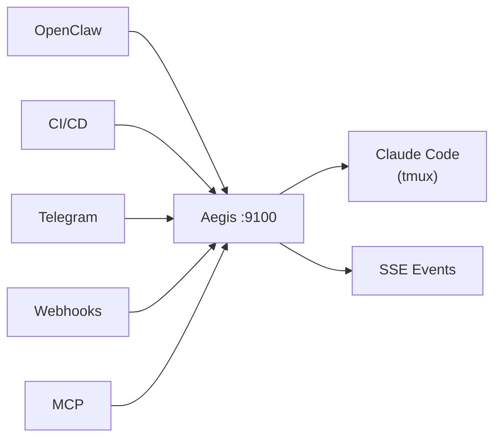

<p align="center">
  
</p>

<p align="center">
  
  
  
  
</p>

<p align="center">
  <strong>Orchestrate Claude Code sessions via REST API, MCP, CLI, webhooks, or Telegram.</strong>
</p>

<p align="center">
  
</p>

---

## Quick Start

```bash
# Install and start
npx aegis-bridge

# Create a session
curl -X POST http://localhost:9100/v1/sessions \
  -H "Content-Type: application/json" \
  -d '{"name": "feature-auth", "workDir": "/home/user/my-project", "prompt": "Build a login page with email/password fields."}'

# Send a follow-up
curl -X POST http://localhost:9100/v1/sessions/abc123/send \
  -H "Content-Type: application/json" \
  -d '{"text": "Add form validation: email must contain @, password min 8 chars."}'
```

> **Prerequisites:** [tmux](https://github.com/tmux/tmux) and [Claude Code CLI](https://docs.anthropic.com/en/docs/claude-code).

---

## How It Works

Aegis wraps Claude Code in tmux sessions and exposes everything through a unified API. No SDK dependency, no browser automation — just tmux + JSONL transcript parsing.

1. Creates a tmux window → launches Claude Code inside it
2. Sends messages via `tmux send-keys` with delivery verification (up to 3 retries)
3. Parses output from both terminal capture and JSONL transcripts
4. Detects state changes: working, idle, permission prompts, stalls
5. Fans out events to Telegram, webhooks, and SSE streams



---

## MCP Server

Connect any MCP-compatible agent to Claude Code — the fastest way to build multi-agent workflows.

```bash
# Start standalone
aegis-bridge mcp

# Add to Claude Code
claude mcp add --scope user aegis -- npx aegis-bridge mcp
```

Or via `.mcp.json`:

```json
{
  "mcpServers": {
    "aegis": {
      "command": "npx",
      "args": ["aegis-bridge", "mcp"]
    }
  }
}
```

**21 tools** — `create_session`, `send_message`, `get_transcript`, `approve_permission`, `batch_create_sessions`, `create_pipeline`, and more.

**4 resources** — `aegis://sessions`, `aegis://sessions/{id}/transcript`, `aegis://sessions/{id}/pane`, `aegis://health`

**3 prompts** — `implement_issue`, `review_pr`, `debug_session`

---

## REST API

All endpoints under `/v1/`.

| Method | Endpoint | Description |
|--------|----------|-------------|
| `GET` | `/v1/health` | Server health & uptime |
| `POST` | `/v1/sessions` | Create a session |
| `GET` | `/v1/sessions` | List sessions |
| `GET` | `/v1/sessions/:id` | Session details |
| `GET` | `/v1/sessions/:id/read` | Parsed transcript |
| `GET` | `/v1/sessions/:id/events` | SSE event stream |
| `POST` | `/v1/sessions/:id/send` | Send a message |
| `POST` | `/v1/sessions/:id/approve` | Approve permission |
| `POST` | `/v1/sessions/:id/reject` | Reject permission |
| `POST` | `/v1/sessions/:id/interrupt` | Ctrl+C |
| `DELETE` | `/v1/sessions/:id` | Kill session |
| `POST` | `/v1/sessions/batch` | Batch create |
| `POST` | `/v1/pipelines` | Create pipeline |

<details>
<summary>Full API Reference</summary>

| Method | Endpoint | Description |
|--------|----------|-------------|
| `GET` | `/v1/sessions/:id/pane` | Raw terminal capture |
| `GET` | `/v1/sessions/:id/health` | Health check with actionable hints |
| `GET` | `/v1/sessions/:id/summary` | Condensed transcript summary |
| `POST` | `/v1/sessions/:id/screenshot` | Screenshot a URL (Playwright) |
| `POST` | `/v1/sessions/:id/escape` | Send Escape |
| `GET` | `/v1/pipelines` | List all pipelines |
| `GET` | `/v1/pipelines/:id` | Get pipeline status |

</details>

<details>
<summary>Session States</summary>

| State | Meaning | Action |
|-------|---------|--------|
| `working` | Actively generating | Wait or poll `/read` |
| `idle` | Waiting for input | Send via `/send` |
| `permission_prompt` | Awaiting approval | `/approve` or `/reject` |
| `asking` | Claude asked a question | Read `/read`, respond `/send` |
| `stalled` | No output for >5 min | Nudge `/send` or `DELETE` |

</details>

---

## Integrations

### Telegram

Bidirectional chat with topic-per-session threading. Send prompts from your phone, get completions pushed back.

```bash
export AEGIS_TG_TOKEN="your-bot-token"
export AEGIS_TG_GROUP="-100xxxxxxxxx"
```

### Webhooks

Push events to any endpoint with exponential backoff retry.

```bash
export AEGIS_WEBHOOKS="https://your-app.com/api/aegis-events"
```

### Multi-Agent Orchestration

AI orchestrators delegate coding tasks through Aegis — monitor progress, send refinements, handle errors, all without a human in the loop.

Works with [OpenClaw](https://openclaw.ai), custom orchestrators, or any agent that can make HTTP calls.

---

## Configuration

**Priority:** CLI `--config` > `./aegis.config.json` > `~/.aegis/config.json` > defaults

| Variable | Default | Description |
|----------|---------|-------------|
| `AEGIS_PORT` | 9100 | Server port |
| `AEGIS_HOST` | 127.0.0.1 | Server host |
| `AEGIS_AUTH_TOKEN` | — | Bearer token for API auth |
| `AEGIS_TMUX_SESSION` | aegis | tmux session name |
| `AEGIS_TG_TOKEN` | — | Telegram bot token |
| `AEGIS_TG_GROUP` | — | Telegram group chat ID |
| `AEGIS_WEBHOOKS` | — | Webhook URLs (comma-separated) |

---

## Contributing

```bash
git clone https://github.com/OneStepAt4time/aegis.git
cd aegis
npm install
npm run dev          # build + start
npm test             # vitest suite
npx tsc --noEmit     # type-check
```

<details>
<summary>Project Structure</summary>

```
src/
├── cli.ts                # CLI entry (npx aegis-bridge)
├── server.ts             # Fastify HTTP server + routes
├── session.ts            # Session lifecycle
├── tmux.ts               # tmux operations
├── monitor.ts            # State monitoring + events
├── terminal-parser.ts    # Terminal state detection
├── transcript.ts         # JSONL parsing
├── mcp-server.ts         # MCP server (stdio)
├── events.ts             # SSE streaming
├── pipeline.ts           # Batch + pipeline orchestration
├── channels/
│   ├── manager.ts        # Event fan-out
│   ├── telegram.ts       # Telegram channel
│   └── webhook.ts        # Webhook channel
└── __tests__/            # Vitest tests
```

</details>

---

## Support the Project

<p align="center">
  <a href="https://github.com/sponsors/OneStepAt4time">
    
  </a>
  <a href="https://ko-fi.com/onestepat4time">
    
  </a>
</p>

---

## License

MIT — [Emanuele Santonastaso](https://github.com/OneStepAt4time)
