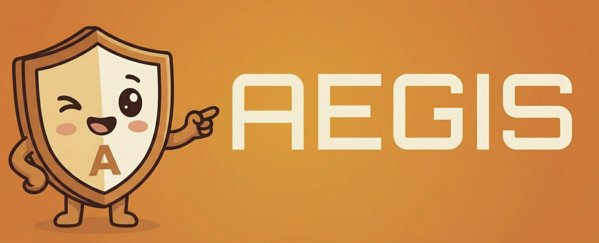
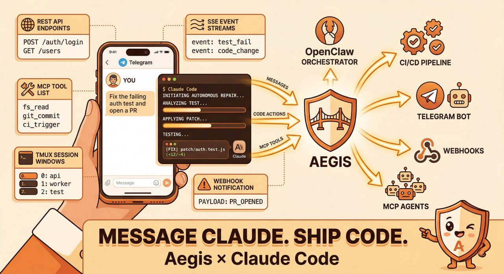
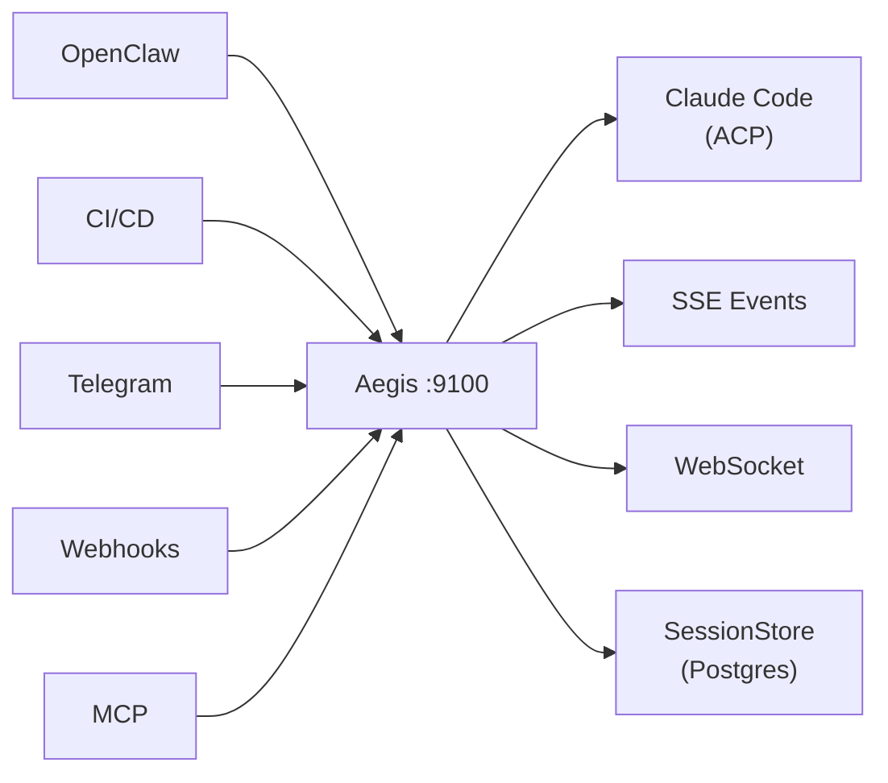

<p align="center">
  
</p>

<p align="center">
  
  
  
  
  
  <a href="https://github.com/OneStepAt4time/aegis/blob/main/ROADMAP.md"></a>
</p>

> ⚠️ **Aegis is in Preview.** APIs may change. See [ROADMAP.md](./ROADMAP.md) for the path to stable.
>
> 📦 **Package:** [`@onestepat4time/aegis`](https://www.npmjs.com/package/@onestepat4time/aegis) on npm. See [ACP Migration Guide](docs/acp-migration-guide.md) if upgrading from `aegis-bridge`.

<p align="center">
  <strong>Run Claude Code agents from your terminal. Approve from your phone. See everything on one dashboard.</strong>
</p>

<p align="center">
  
</p>

---

## Quick Start

> 🚧 **Upcoming** — This flow tracks [#3489](https://github.com/OneStepAt4time/aegis/issues/3489) (Zero-Config Epic). See the [current getting-started guide](docs/getting-started.md) for the step-by-step setup that works today.

One command. Zero config. Claude Code responds in your terminal.

```bash
npx --package=@onestepat4time/aegis ag run "Summarize this folder and suggest improvements" --cwd ./my-project
```

That's it. Aegis:
1. Bootstraps its config (first run only)
2. Starts the server
3. Creates a Claude Code session
4. Streams Claude's response to your terminal

When Claude needs permission to run a command or edit a file, you'll see a prompt in your terminal. Approve or deny right there.

<details>
<summary>What you'll see</summary>

```
$ npx --package=@onestepat4time/aegis ag run "Build a login page" --cwd ./my-project

  Aegis v0.7.0
  ✓ Claude Code found
  ✓ Server started → http://127.0.0.1:9100/dashboard
  ✓ Session created: cc-build-a-login-page

  [Claude] I'll build a login page with email and password fields...
  [Claude] ├── Creating src/components/LoginForm.tsx
  [Claude] └── Creating src/pages/Login.tsx

  🔔 Permission required: Write to src/components/LoginForm.tsx
  Allow? [Y/n] >
```

</details>

<details>
<summary>Global install (optional — faster on repeated use)</summary>

```bash
npm install -g @onestepat4time/aegis
ag run "Your prompt here" --cwd ./my-project
```

</details>

### Next Steps

After your first session, you might want to:

- **Dashboard** — open <http://127.0.0.1:9100/dashboard> to see sessions, cost analytics, and audit trails
- **Telegram** — approve agent actions from your phone: `ag setup telegram` (one guided setup)
- **MCP** — let Claude Code control Aegis: `claude mcp add --scope user aegis -- ag mcp`
- **Multiple sessions** — `ag run "fix the tests" & ag run "update the README"` (parallel agents)

<details>
<summary>Configuration (optional)</summary>

Aegis works out of the box. If you want to customize:

```bash
ag init              # Interactive setup (token, model, Telegram, etc.)
ag init --defaults    # Non-interactive — use all defaults
ag init --force       # Overwrite existing config
```

Configuration file: `~/.aegis/config.yaml`. All settings have sensible defaults for local development.

See [Getting Started](docs/getting-started.md) for the full configuration reference.

</details>

<details>
<summary>Starter templates</summary>

```bash
ag init --list-templates
ag init --from-template code-reviewer
```

Built-in templates: `code-reviewer`, `ci-runner`, `pr-reviewer`, `docs-writer`.

</details>

> **Prerequisites:** [Node.js ≥ 20](https://nodejs.org/) and [Claude Code CLI](https://docs.anthropic.com/en/docs/claude-code) (authenticated). That's it.

> **CLI naming:** the primary command is `ag`. The legacy name `aegis` is preserved as an alias.

### Windows

```powershell
npm install -g @onestepat4time/aegis
ag run "Your prompt here" --cwd C:\my-project
```

For troubleshooting, see [Windows Setup](docs/windows-setup.md).

---

**Learn more:** [Getting Started](docs/getting-started.md) · [MCP Tools](docs/mcp-tools.md) · [BYO LLM](docs/byo-llm.md) · [Advanced Features](docs/advanced.md) · [Deployment Guide](docs/deployment.md)

---

## How It Works

Aegis bridges Claude Code sessions through the Agent Client Protocol (ACP) and exposes everything through a unified API. No SDK dependency, no browser automation — just JSON-RPC over stdio.

1. Spawns `claude-agent-acp` as a child process → communicates via JSON-RPC on stdio
2. Sends prompts via structured JSON-RPC requests with timeout and cancellation support
3. Receives structured ACP events — text deltas, tool calls, approvals, usage updates
4. Maps ACP events into normalized Aegis domain events for replay and fanout
5. Fans out events to Telegram, Slack, Email, webhooks, and SSE streams
6. Stores session state, events, and actions locally (file-backed by default)


```mermaid
graph LR
    OC["OpenClaw"] --> API["Aegis :9100"]
    CI["CI/CD"]     --> API
    TG["Telegram"]  --> API
    WH["Webhooks"]  --> API
    MCP["MCP"]      --> API
    API --> CC["Claude Code<br/>(ACP)"]
    API --> SSE["SSE Events"]
    API --> WS["WebSocket"]
    API --> PG["SessionStore<br/>(Postgres)"]
```

---

## MCP Server

Connect any MCP-compatible agent to Claude Code — the fastest way to build multi-agent workflows.

```bash
# Start standalone
ag mcp

# Add to Claude Code
claude mcp add --scope user aegis -- ag mcp
```

Or via `.mcp.json`:

```json
{
  "mcpServers": {
    "aegis": {
      "command": "ag",
      "args": ["mcp"]
    }
  }
}
```

Without a global install, use `"command": "npx"` with `["--package=@onestepat4time/aegis", "ag", "mcp"]` instead.

**34 tools** — `create_session`, `send_message`, `get_transcript`, `approve_permission`, `acp_send_prompt`, `acp_respond_approval`, `batch_create_sessions`, `create_pipeline`, `state_set`, and more.

**3 resources** — `aegis://sessions`, `aegis://sessions/{id}/transcript`, `aegis://health`

**3 prompts** — `implement_issue`, `review_pr`, `debug_session`

## Ecosystem Integrations

Aegis works beyond Claude Code anywhere an MCP host can launch a local stdio server.

- [CLI Reference](docs/integrations/cli.md) — `ag` command-line tool (alias: `aegis`)
- [Notification Channels](docs/integrations/notifications.md) — Telegram, Slack, Email, Webhooks
- [Cursor integration](docs/integrations/cursor.md)
- [Windsurf integration](docs/integrations/windsurf.md)
- [MCP Registry preparation](docs/integrations/mcp-registry.md)

---

## REST API

All endpoints under `/v1/`.

| Method | Endpoint | Description |
|--------|----------|-------------|
| `GET` | `/v1/health` | Server health & uptime |
| `POST` | `/v1/sessions` | Create a session (reuse if `workDir` matches an idle session) |
| `GET` | `/v1/sessions` | List sessions |
| `GET` | `/v1/sessions/:id` | Session details |
| `GET` | `/v1/sessions/:id/read` | Parsed transcript |
| `GET` | `/v1/sessions/:id/events` | SSE event stream *(requires `sse_`-prefixed token)* |
| `POST` | `/v1/sessions/:id/send` | Send a message |
| `POST` | `/v1/sessions/:id/approve` | Approve permission |
| `POST` | `/v1/sessions/:id/reject` | Reject permission |
| `POST` | `/v1/sessions/:id/interrupt` | Ctrl+C |
| `POST` | `/v1/sessions/:id/discover-commands` | Discover available slash commands |
| `DELETE` | `/v1/sessions/:id` | Kill session |
| `POST` | `/v1/sessions/batch` | Batch create |
| `POST` | `/v1/handshake` | Capability negotiation |
| `POST` | `/v1/pipelines` | Create pipeline |
| `POST` | `/v1/memory` | Set memory entry |
| `GET` | `/v1/memory` | List memory entries |
| `GET` | `/v1/memory/:key` | Get memory entry |
| `DELETE` | `/v1/memory/:key` | Delete memory entry |
| `POST` | `/v1/templates` | Create session template |
| `GET` | `/v1/templates` | List templates |
| `GET` | `/v1/templates/:id` | Get template |
| `PUT` | `/v1/templates/:id` | Update template |
| `DELETE` | `/v1/templates/:id` | Delete template |
| `GET` | `/v1/diagnostics` | Server diagnostics |

<details>
<summary>Full API Reference</summary>

| Method | Endpoint | Description |
|--------|----------|-------------|
| `GET` | `/v1/sessions/:id/health` | Health check with actionable hints |
| `GET` | `/v1/sessions/:id/summary` | Condensed transcript summary |
| `GET` | `/v1/sessions/:id/transcript/cursor` | Cursor-based transcript replay |
| `POST` | `/v1/sessions/:id/screenshot` | Screenshot a URL (Playwright) |
| `POST` | `/v1/sessions/:id/escape` | Send Escape |
| `GET` | `/v1/pipelines` | List all pipelines |
| `GET` | `/v1/pipelines/:id` | Get pipeline status |

</details>

<details>
<summary>Session States</summary>

| State | Meaning | Action |
|-------|---------|--------|
| `working` | Actively generating | Wait or poll `/read` |
| `idle` | Waiting for input | Send via `/send` |
| `permission_prompt` | Awaiting approval | `/approve` or `/reject` |
| `asking` | Claude asked a question | Read `/read`, respond `/send` |
| `pending` | Initial state, connecting to ACP runtime | Wait a moment and re-poll |
| `error` | Session error | Check diagnostics, recreate |
| `rate_limit` | Rate limited by provider | Wait and retry |
| `killed` | Stopped via API (terminal) | Session retained for audit |
| `completed` | Finished normally (terminal) | Session retained for audit |
| `crashed` | Terminated unexpectedly (terminal) | Check diagnostics |
| `unknown` | Failed to determine state | Check diagnostics |

</details>

<details>
<summary>Session Reuse</summary>

When you `POST /v1/sessions` (or `POST /sessions`) with a `workDir` that already has an **idle** session, Aegis reuses that session instead of creating a duplicate. The existing session's prompt is delivered and you get the same session object back.

**Response differences:**

| | New Session | Reused Session |
|---|---|---|
| Status | `201 Created` | `200 OK` |
| `reused` | `false` | `true` |
| `promptDelivery` | `{ delivered, attempts }` | `{ delivered, attempts }` |

```bash
# First call → creates session (201)
curl -s -o /dev/null -w "%{http_code}" -X POST http://localhost:9100/v1/sessions \
  -H "Content-Type: application/json" \
  -d '{"workDir": "/home/user/project", "prompt": "Fix the tests"}'
# → 201

# Same workDir while idle → reuses session (200)
curl -s -o /dev/null -w "%{http_code}" -X POST http://localhost:9100/v1/sessions \
  -H "Content-Type: application/json" \
  -d '{"workDir": "/home/user/project", "prompt": "Now add error handling"}'
# → 200, body includes "reused": true
```

Only **idle** sessions are reused. Working, stalled, or permission-prompt sessions are ignored — a new one is created.

</details>

<details>
<summary>Capability Handshake</summary>

Before using advanced integration paths, clients can negotiate capabilities with Aegis via `POST /v1/handshake`. This prevents version-drift breakage.

```bash
curl -X POST http://localhost:9100/v1/handshake \
  -H "Content-Type: application/json" \
  -d '{"protocolVersion": "1", "clientCapabilities": ["session.create", "session.transcript.cursor"]}'
```

**Response** (200 OK when compatible):

```json
{
  "protocolVersion": "1",
  "serverCapabilities": ["session.create", "session.resume", "session.approve", "session.transcript", "session.transcript.cursor", "session.events.sse", "session.screenshot", "hooks.pre_tool_use", "hooks.post_tool_use", "hooks.notification", "hooks.stop", "swarm", "metrics"],
  "negotiatedCapabilities": ["session.create", "session.transcript.cursor"],
  "warnings": [],
  "compatible": true
}
```

| Field | Description |
|-------|-------------|
| `protocolVersion` | Server's protocol version (`"1"` currently) |
| `serverCapabilities` | Full list of server-supported capabilities |
| `negotiatedCapabilities` | Intersection of client + server capabilities |
| `warnings` | Non-fatal issues (unknown caps, version skew) |
| `compatible` | `true` (200) or `false` (409 Conflict) |

Returns **409** if the client's `protocolVersion` is below the server minimum.

</details>

<details>
<summary>Cursor-Based Transcript Replay</summary>

Stable pagination for long transcripts that doesn't skip or duplicate messages under concurrent appends. Use instead of offset-based `/read` when you need reliable back-paging.

```bash
# Get the newest 50 messages
curl http://localhost:9100/v1/sessions/abc123/transcript/cursor

# Get the next page (pass oldest_id from previous response)
curl "http://localhost:9100/v1/sessions/abc123/transcript/cursor?before_id=16&limit=50"

# Filter by role
curl "http://localhost:9100/v1/sessions/abc123/transcript/cursor?role=user"
```

**Query params:**

| Param | Default | Description |
|-------|---------|-------------|
| `before_id` | (none) | Cursor ID to page before. Omit for newest entries. |
| `limit` | `50` | Entries per page (1–200). |
| `role` | (none) | Filter: `user`, `assistant`, or `system`. |

**Response:**

```json
{
  "messages": [...],
  "has_more": true,
  "oldest_id": 16,
  "newest_id": 25
}
```

Cursor IDs are stable — they won't shift when new messages are appended. Use `oldest_id` from one response as `before_id` in the next to page backwards without gaps or overlaps.

</details>

---

### Telegram

Bidirectional chat with topic-per-session threading. Send prompts from your phone, get completions pushed back.

```bash
export AEGIS_TG_TOKEN="your-bot-token"
export AEGIS_TG_GROUP="-100xxxxxxxxx"
```

### Webhooks

Push events to any endpoint with exponential backoff retry.

```bash
export AEGIS_WEBHOOKS="https://your-app.com/api/aegis-events"
```

### Multi-Agent Orchestration

AI orchestrators delegate coding tasks through Aegis — monitor progress, send refinements, handle errors, all without a human in the loop.

Works with [OpenClaw](https://openclaw.ai), custom orchestrators, or any agent that can make HTTP calls.

### Web Dashboard

Aegis ships with a built-in dashboard at `http://localhost:9100/dashboard/` — real-time session monitoring, activity streams, and health overview.

**Dashboard features:**
- Dark/light theme with system preference detection
- Full accessibility pass — ARIA landmarks, labels, skip-to-content, 24 a11y tests
- Internationalization scaffolding with language switcher (Italian catalog shipped)
- Keyboard shortcuts for fast navigation (`?`, `Ctrl+K`, `G+O/S/P/A/U`)
- Session search, filter by date range, CSV export
- Metric cards with sparkline mini-charts
- Consistent empty states across all pages
- Routines page with calendar-style view for scheduled tasks (Phase 1 — UI scaffold)
- Toast notifications for user feedback

```bash
ag                                 # visit http://localhost:9100/dashboard/
```

---

## Use Cases & Deployment Tiers

Aegis serves three deployment scenarios:

### Tier 1 — Local Orchestration
**Single developer.** Run Claude Code tasks in the background, monitor via dashboard, approve via Telegram.

```bash
ag
# Dashboard: http://localhost:9100/dashboard/
# Telegram approvals while AFK
```

### Tier 2 — CI/CD & Team Automation
**Development teams.** Policy-based permission control, batch operations, Slack notifications.

```bash
# Blueprint: PR Reviewer
curl -X POST http://localhost:9100/v1/pipelines \
  -H "Authorization: Bearer $TOKEN" \
  -d '{"name":"pr-reviewer","stages":[...],"permissionMode":"plan"}'
```

### Tier 3 — Zero-Trust Enterprise
**Banks, SaaS, regulated industries.** Docker-isolated containers, no network egress, audit-first.

- Each task runs in an ephemeral Docker container
- No cross-container networking
- Immutable audit log for compliance
- See [Enterprise Deployment](docs/enterprise.md) for production hardening guide

**Golden rule:** Intelligence stays outside Aegis. Aegis is a stupid-but-powerful middleware — flows, security, audit. OpenClaw (or any external orchestrator) provides the brains.

---

## Security

Aegis is built with production security as a first-class concern — not an afterthought.

### Authentication & Authorization

- **Bearer token auth** — `AEGIS_AUTH_TOKEN` protects all endpoints except `/v1/health`
- **SSE token separation** — dedicated `sse_`-prefixed tokens for event streams (regular API keys are rejected on SSE routes)
- **API key management** — CRUD with role-based access (admin, operator, viewer, custom)
- **Hook secret authentication** — `X-Hook-Secret` header with header-only enforcement mode

### Audit & Compliance

- **Immutable audit trail** — hash-chained event log for every session action
- **Permission policies** — configurable approval/rejection per tool, per session
- **Per-IP rate limiting** — auth failure limits, connection limits, request throttling

### Observability

- **OpenTelemetry tracing** — distributed spans for HTTP, session lifecycle, tool invocations, and channel delivery
- **Prometheus metrics** — standard exposition format for session counts, tool usage, latency histograms
- **SSE real-time events** — live session state, permission requests, tool calls

### Network Security

- **Default localhost binding** — `127.0.0.1` unless explicitly configured
- **Docker auto-detection** — binds `0.0.0.0` in containers, `127.0.0.1` everywhere else
- **No telemetry home** — Aegis never phones home or sends data to external services
- **Self-hosted only** — your data stays on your infrastructure

### Safety Mechanisms

- **Circuit breaker** — detects rapid hook failure loops and trips breaker to prevent session death
- **Payload validation** — strict Zod schema validation on all inbound hooks
- **Payload truncation protection** — warns when hook payloads approach Claude Code's 2KB truncation limit
- **WebSocket auth** — session existence is not revealed before authentication

For the full security questionnaire (pre-filled for vendor assessments), see [Security Questionnaire](docs/SECURITY_QUESTIONNAIRE.md). For deployment hardening, see [Enterprise Deployment](docs/enterprise.md).

---

## Configuration

**Priority:** CLI `--config` > `./.aegis/config.yaml` > `./aegis.config.json` > `~/.aegis/config.yaml` > `~/.aegis/config.json` > defaults

| Variable | Default | Description |
|----------|---------|-------------|
| `AEGIS_BASE_URL` | `http://127.0.0.1:9100` | Preferred API origin for hooks, CLI clients, and dashboard links |
| `AEGIS_PORT` | 9100 | Server port |
| `AEGIS_HOST` | 127.0.0.1 | Server host |
| `AEGIS_AUTH_TOKEN` | — | Bearer token for API auth |
| `AEGIS_DASHBOARD_ENABLED` | `true` | Serve the bundled dashboard |
| `AEGIS_PERMISSION_MODE` | default | `default`, `bypassPermissions`, `plan`, `acceptEdits`, `dontAsk`, `auto` |
| `AEGIS_ACP_BIN` | — | Override path to `claude-agent-acp` binary |
| `AEGIS_TG_TOKEN` | — | Telegram bot token |
| `AEGIS_TG_GROUP` | — | Telegram group chat ID |
| `AEGIS_WEBHOOKS` | — | Webhook URLs (comma-separated) |
| `AEGIS_HOOK_SECRET_HEADER_ONLY` | false | Enforce `X-Hook-Secret` header and reject deprecated `?secret=` transport |

---

## Contributing

See [CONTRIBUTING.md](./CONTRIBUTING.md) for the full guide — issue workflow, labels, commit conventions, and PR requirements.

```bash
git clone https://github.com/OneStepAt4time/aegis.git
cd aegis
npm install
npm run dev          # build + start
npm test             # vitest suite
npx tsc --noEmit     # type-check
```

<details>
<summary>Project Structure</summary>

```
src/
├── cli.ts                # CLI entry (`ag`; alias: `aegis`)
├── services/acp/          # ACP runtime (child process, JSON-RPC, events)
├── server.ts             # Fastify HTTP server + routes
├── session.ts            # Session lifecycle
├── monitor.ts            # State monitoring + events
├── transcript.ts         # JSONL parsing
├── mcp-server.ts         # MCP server (stdio)
├── events.ts             # SSE streaming
├── pipeline.ts           # Batch + pipeline orchestration
├── channels/
│   ├── manager.ts        # Event fan-out
│   ├── telegram.ts       # Telegram channel
│   ├── slack.ts          # Slack incoming webhook channel
│   ├── email.ts          # SMTP email alert channel
│   └── webhook.ts        # Webhook channel
└── __tests__/            # Vitest tests
```

</details>

---

## Client SDKs

### TypeScript

Official `@onestepat4time/aegis-client` package — generated from the OpenAPI 3.1 specification.

```bash
npm install @onestepat4time/aegis-client
```

```typescript
import { AegisClient } from '@onestepat4time/aegis-client';

const client = new AegisClient('http://localhost:9100', process.env.AEGIS_AUTH_TOKEN);

// List sessions
const sessions = await client.listSessions();

// Create a session
const { id } = await client.createSession({ workDir: '/path/to/project' });

// Send a message
await client.sendMessage(id, 'Hello, Claude!');

// Approve a permission
await client.approvePermission(id);
```

**What's included:**
- Generated from OpenAPI spec — all 53 REST endpoints with full TypeScript types
- Backward-compatible class API + function-based API for new code
- Sessions, health, metrics, pipelines, templates, memory, audit log
- Works in Node.js and browser (fetch-based, zero external HTTP deps)

See [`packages/client/`](packages/client/) for the full SDK source.

## Python Client SDK

Official `ag-client` package generated from the OpenAPI contract — 53 methods, Pydantic v2 models, stdlib HTTP.

```bash
pip install ag-client
```

```python
from aegis_python_client import AegisClient

client = AegisClient(base_url="http://localhost:9100", auth_token="your-token")

# List sessions
sessions = client.list_sessions()

# Create a session
session = client.create_session(work_dir="/path/to/project", prompt="Hello!")

# Send a message
client.send_message(session.id, "Fix the tests")

# Approve a permission
client.approve_permission(session.id)
```

**What's included:**
- 53 methods covering all REST endpoints
- Pydantic v2 models for request/response types
- Uses Python stdlib `http.client` — zero runtime dependencies
- Type-safe with full IDE autocompletion

See [`packages/python-client/`](packages/python-client/) for the full SDK source.


## Documentation

- **[Getting Started](docs/getting-started.md)** — Zero to first session in 5 minutes
- **[Why Aegis?](docs/why-aegis.md)** — How Aegis differs from dev tools and multi-agent frameworks
- **[Roadmap](ROADMAP.md)** — Phase 3 (Team & Early-Enterprise) is now active
- **[External Deployment Guide](EXTERNAL_DEPLOYMENT_GUIDE.md)** — Step-by-step for external teams
- **[API Reference](docs/api-reference.md)** — Complete REST API documentation
- **[ACP Major Cutover Release Plan](docs/acp-major-cutover-release-plan.md)** — Phase 3.5 breaking-release governance
- **[MCP Tools](docs/mcp-tools.md)** — 34 MCP tools and 3 prompts
- **[Advanced Features](docs/advanced.md)** — Pipelines, Memory Bridge, templates
- **[Enterprise Deployment](docs/enterprise.md)** — Auth, rate limiting, security, production
- **[Enterprise Technical Review](docs/enterprise/index.md)** — Deep architecture, security, observability, and roadmap analysis
- **[Architecture](docs/architecture.md)** — Module overview and design
- **[ACP Migration Guide](docs/acp-migration-guide.md)** — Upgrading from `aegis-bridge`
- **[Notifications](docs/integrations/notifications.md)** — Telegram, Slack, Email, webhooks
- **[Deployment Guide](docs/deployment.md)** — Secure access away from localhost
- **[Remote Access](docs/remote-access.md)** — External access configuration
- **[BYO LLM](docs/byo-llm.md)** — OpenAI-compatible provider setup (GLM, OpenRouter, LM Studio, Ollama)
- **[Troubleshooting](docs/troubleshooting.md)** — Common issues and fixes
- **[Known Issues](docs/known-issues.md)** — Active bugs with workarounds
- **[Release Process](docs/release-process.md)** — Maintainer runbook for production releases
- **[Disaster Recovery](docs/DISASTER_RECOVERY.md)** — Data loss and infrastructure failure recovery
- **[Incident and Rollback Runbook](docs/incident-rollback-runbook.md)** — Deployment rollbacks and version pinning
- **[TypeDoc API](https://onestepat4time.github.io/aegis/)** — Auto-generated TypeScript reference

---

## Support the Project

<p align="center">
  <a href="https://github.com/sponsors/OneStepAt4time">
    
  </a>
  <a href="https://ko-fi.com/onestepat4time">
    
  </a>
</p>

---

## License

MIT — [Emanuele Santonastaso](https://github.com/OneStepAt4time)

